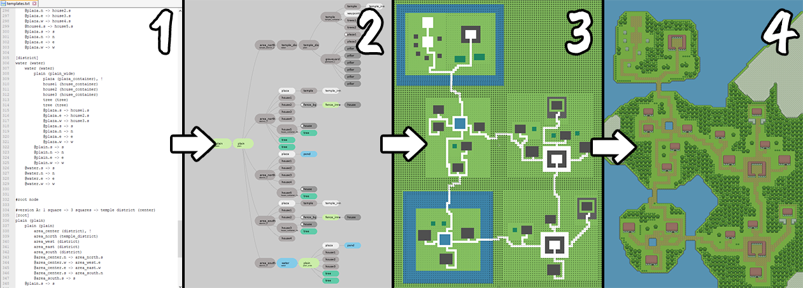

## About the Project

The goal of this project was to create a reusable method for procedurally generating tile maps of arbitrary size, complexity and purpose (dungeons, towns, continents, custom shapes, you name it). This is done by specifying a set of local rules (a generative grammar), and thus decoupling the general system (_HOW things are generated_) from specific instructions (_WHAT things are generated_).

Map templates are used to generate possible map graphs, which are then converted into 2-dimensional maps by recursively arranging and connecting their nodes from the bottom up until every required structure and road is generated. The end result can then (optionally) undergo post-processing to add more details.



The project is written in Python and includes both a pygame-based interface (*main.py*) for visualizing results of writing specific grammars included in a maps directory, as well as an example of using the generator to directly generate maps from specific files (*ascii_level_example.py*).

To create and test your own map, either copy one of the existing map folders under a different name and edit the included text files, or create a completely new folder with a .txt file containing different rules from scratch.

**For much more detailed documentation, including how map templates are interpreted and how to write them, see *documentation.pdf*, included with the project as a classy .pdf file.**


## Features and Limitations

This approach to procedural map generation is based on two defining principles:

* **Universality:** There is just one system for generating everything, whether it's areas of the world map, buildings in a town, or objects in a room.
* **Completeless:** Once a map plan is selected, every part of that plan is guaranteed to be generated somewhere down the line.

Some other design considerations:

* It lets map layouts to reflect intentional design instead of just repeating randomness, which is a common complaint about video game procedurally generated content.
* It can be combined with other algorithms to improve the result once the structure is generated and stored.
* It allows for using various templates within one project, e.g. using one template for generating the world map and other templates for specific areas.
* It's "AI-friendly" - since map templates are just structured text data, they can also be generated using LLM prompts (without relying on image generation, which could lead to controversies over use of human artists' work as training data).

And finally, some consequences and limitations of the current version:

* The final map size is arbitrary and cannot be predicted, because it depends on the size and arrangement of components. This inherent lack of limits is one of the project's inherent limits.
* Paths always start and end at central points of an area's edge, often causing paths to curve towards that point and 'zigzag' across area boundaries instead of just going straight.
* The options for randomizing the number of nodes and their path connections are currently more limited than randomizing nodes themselves, since my early focus was on the "deterministic" side of map generation.
* Performance considerations - in particular, the postprocessing step for large maps needs major optimizations.
* Some tile transitions are currently missing, and the set of tiles itself is rather small.


## Algorithm

The basic stages of generation:

1. Map template: Grammar for generating map graphs, provided as a text file. Allows for multiple ways to construct the map graph from the top down. This is what .txt files in the ‘maps’ directory define.

2. Map graph: One specific instance generated from the map template and a specific seed. Only one arrangement of areas and paths is selected.	This is what the main.py interface shows after loading a map, changing seed selects a different graph.

3. Generated map: Two-dimensional tile map generated from a specific map graph from the bottom up (with minimal randomness affected by the seed). This outcome can be split into 2 major steps: an initial map, close to the graph, and a second step adding post-processing and graphics.

The conversion of the map graph (2) into the final map (3) is the most important step of map generation and includes recursively generating structures from the bottom up, building larger and larger structures.


### Map Templates

Map templates use a custom syntax , currently divided into defining basic structure classes and templates (including [root]) separately, as in the example below.

```
=== STRUCTURES ===
house_small	5/5/2, building
house_big	7/5/2, building
plain		0/0/1, grass
cave		0/0/1, rock

=== TREE ===
[root]
town (plain)
	house1 (house_small)
	house2 (house_big)
	@house1.s -> house2.w
```

For more details, read **documentation.pdf** included in the files.


### Map Generation

The map generation step in *generator_map.py* works roughly as follows:
___

* `GeneratedMap.generateStructures`:
  * `generateNextViableNode`:
    * reset seed based on world seed
    * pick the next viable node to generate (a node whose child nodes are already generated, either because they are leaf nodes with fixed structure or because they were generated previously) 
    * `generateNode`:
      * create an arrangement object containing child node placements
      * call ```generateStructures``` for the node’s child nodes:
        * collect child structures to generate (leaf structures or procedural ones)
        * call `addStructures` (important for determining area boundaries)
		  * if no child structures exist, do nothing
		  * if there’s one child structure, just place it in the center
		  * if there are more, arrange child structures, accounting for the way they are connected to minimize lengths of generated paths later on
	   * assign (but don't generate) all required paths from `childPaths`
  * `connectAllPaths`:
    * try to generate paths - if you fail, expand margins and try again until all paths are generated
    * once all paths are generated, contract structures if possible without editing roads
  * freeze the generated arrangement, converting the node into a new complete structure
___


## Ideas for the Future

Features I'd like to implement at some point:
* more randomization methods for roads (connect without specified direction, connect to random areas)
* better support for custom objects and other custom user cases
* expanded tileset(s)
* more map examples
* cliffs/ledges
* optimize postprocessing
* AI map template generation from a prompt

It would also be nice to see the generator ported to Godot, Unity, Love2d, Scratch, TempleOS, etc.


## Repository Contents

If you're interested in using the generator in your own Python project, the files ``generator.py`` and ``ascii_level_example.py`` should be enough to implement it, but here's a more complete description of the components.

* *main.py* - the pygame-based interface for visualizing graphs and maps
* *ascii_level_example.py* - a simple implementation of the generator for an ASCII-based level
* *generator.py* - main generation pipeline, calling the big steps
* *generator_map.py* - the main graph-to-map generation function
* *generator_separation.py* - functions for arranging structures (bouncy rectangles go whoosh)
* *graph_compile.py* - text-processing functions on map rules
* *graph_filter_paths.py* - detecting and removing disconnected outgoing paths (see documentation.pdf)
* *graph_read.py* - converting data from graphs to Python node objects and back
* *tilemap_postprocessing.py* - functions for smoothing, detailing and fixing the map once it's generated
* *tilemap_drawing.py* - functions converting materials into specific drawn tiles
* *drawn_map.py* - object for handling drawing tilemap to the screen
* *astar.py* - A* algorithm
* *calc.py* - basic maths


## Disclaimer

The code is provided “as is”, without warranty of any kind, and without any guarantee that it will be bug-free, or optimized, or fit for specific purposes, or well-written, or consistent in its use of hyphens versus camel case.

Major components of the project changed over time and despite major refactoring, some core features are artefacts inherited from earlier iterations with other features stacked on top of them, making the end result look more like a product of evolution through natural selection rather than intelligent design by a rational human being of sound mind.

Some consequences of the project's evolution visible in the source code:
* Tile maps are arrays of RGB colour values by default, leading to many places where RGB values are assigned variables for readability or converted back and forth into strings.
* Map generation from a graph and graph generation from a set of rules are two separate generation steps.
* There are some unused steps like assigning heightmaps, which always assign default values.
* The terminology in variable names and comments isn't consistent and multiple terms may be used for the same thing, e.g. node categories v. node classes, templates v. definitions, structures v. nodes.


## Contact Details

To contact GitHub, visit:
* Twitter: https://twitter.com/github
* YouTube: https://www.youtube.com/@GitHub
* Support page: https://support.github.com

## License

The source code is licensed under the **Apache License 2.0**, included with the project.

The license also applies to the tileset, but I would appreciate if you follow the  Homework License instead - you can use it, but change it up a bit so it doesn't look obvious you copied. I may release a proper, more complete tileset separately at some point!


## Acknowledgements

The algorithm isn't based on any specific sources, but includes a lot of inspiration from:
* **Linguistics** - in particular the work on sentence linearization and compression by Katja Filipova, who is likely to become very confused if she ever finds out she had randomly inspired a video game-related project.
* **Web markup** - in particular the idea of responsive design and the container system in HTML/CSS.
* **Mark Brown's Game Maker's Toolkit** - in particular the [*Boss Keys*](https://www.youtube.com/playlist?list=PLc38fcMFcV_ul4D6OChdWhsNsYY3NA5B2) video series (obviously!).

Some steps use prior work:
* The A* function used for road generation is based on [Christian Careaga's A* implementation](http://code.activestate.com/recipes/578919-python-a-pathfinding-with-binary-heap/).
* The separation algorithm used to arrange structures is strongly based on the [dungeon generation method](https://www.gamedeveloper.com/programming/procedural-dungeon-generation-algorithm) used in [TinyKeep](https://store.steampowered.com/app/278620/TinyKeep/) and a similar approach implemented by [Sam Bloomerg](https://xbloom.io/2016/04/17/more-complex-dungeon-generation/).

There are also related projects which haven't been a direct inspiration but attempt similar goals, including:
* Joris Dormans's cyclic dungeon generation in [*Unexplored*](https://store.steampowered.com/app/506870/Unexplored/) and [*Unexplored 2*](https://store.steampowered.com/app/1095040/Unexplored_2_The_Wayfarers_Legacy/)
* Becky Lavender's [*Zelda Dungeon Generator*](https://procedural-generation.tumblr.com/post/128663536278/the-zelda-dungeon-generator-becky-lavenders) (primary source no longer online)
* Bytten Studio's [*Lenna's Inception*](https://store.steampowered.com/app/1114870/Lennas_Inception/)

I also owe huge thanks to the organizers of the [Generative Design in Minecraft Settlement Generation Competition](https://gendesignmc.wikidot.com/) (Christoph Salge, Michael Cerny Green, Rodrigo Canaan & Julian Togelius), which inspired me to continue work on PCG-related projects.
